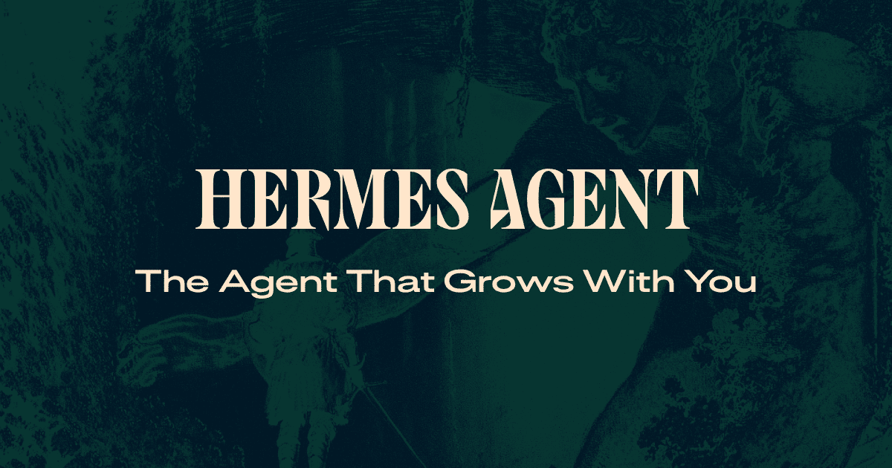
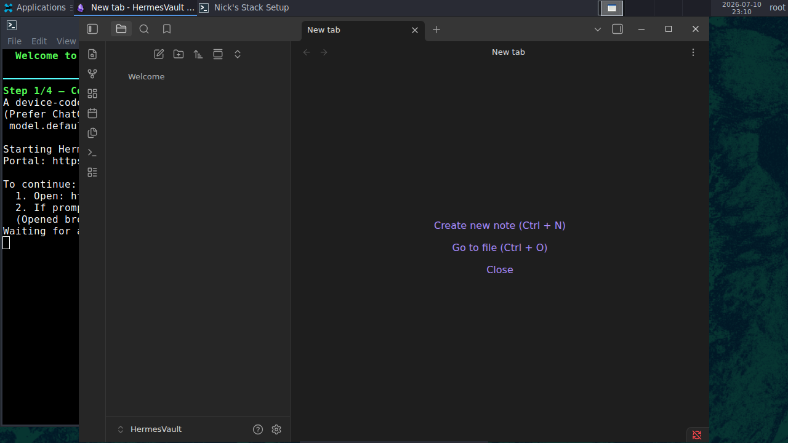
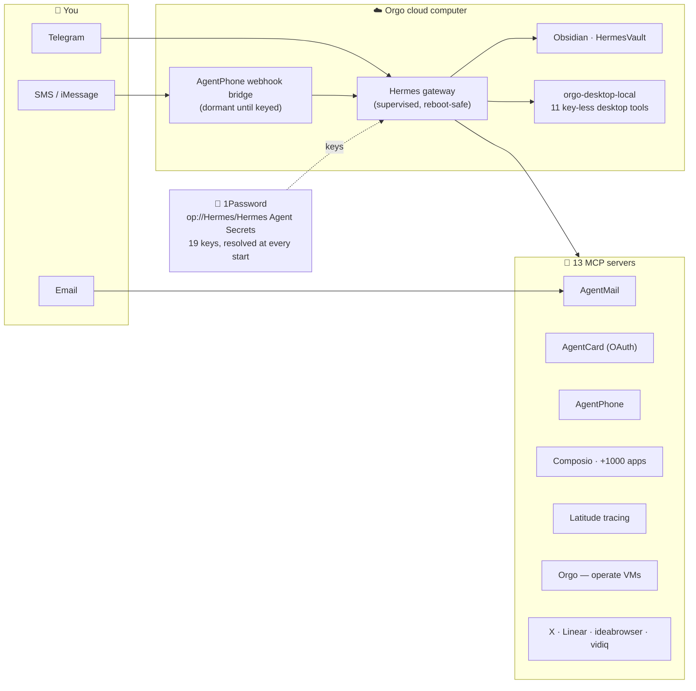

<div align="center">



# Nick's Stack 🚀

**Your own always-on AI agent, on its own cloud computer — with its own phone, email, payment card, and password vault.**

[](https://orgo.ai)
[](https://github.com/NousResearch/hermes-agent)
[](#-whats-in-the-box)
[](#-your-keys-stay-yours)
[](LICENSE)

*Wired **exactly like Nick's live production agent** ("Dewey") — rebuilt byte-for-byte from a full audit of that VM.*
*Scan one QR and you're texting your agent in ~2 minutes.*

</div>

---

## ✨ What it feels like

You launch a cloud desktop. A setup window signs you into the model, you scan a QR with your phone, tap **Create Bot** — and now there's an agent on Telegram that:

- 💬 **texts with you** all day (Telegram; SMS/iMessage via AgentPhone)
- 📬 **has its own email address** and reads/sends mail (AgentMail)
- 💳 **can spend, carefully** with its own virtual card (AgentCard)
- 🔌 **uses your apps** — Gmail, Slack, Calendar, Notion, +1000 (Composio)
- 🖥️ **drives its own desktop** and other Orgo computers (11 built-in desktop tools + the Orgo MCP)
- 📝 **keeps notes** in an Obsidian vault you can open right on its desktop
- 🔭 **is fully observable** — every model + tool call traced to Latitude
- 🔐 **fetches its own keys** from a 1Password vault you control

<div align="center">

<br/><em>First boot — the guided setup walks you through model sign-in, the Telegram QR, and 1Password.</em>
</div>

---

## 🗺️ How it's wired



Every integration ships **key-less**: an unset key just parks that server (it revives within 5 minutes of a key landing, or instantly via `/mcp` in chat). Nothing crash-loops, nothing nags.

---

## 🟢 Easiest way to run it

1. **Make an Orgo account** → [orgo.ai](https://orgo.ai).
2. **Launch the template** (see *Run your own copy* below, or the gallery entry if you're on the curated catalog).
3. The **Nick's Stack Setup** window walks you through:
   - **Connect Nous** — a quick device-code sign-in so `gpt-5.5` can think (it test-fires a 1-token call, so a zero-credit account fails loudly, not silently).
   - **Scan the QR** → tap **Create Bot** in Telegram → your personal bot is live. 🎉
   - **Optional: paste a 1Password service-account token** — one token, every key, forever.
4. **Text your bot.** You're done.

<details>
<summary><b>⚡ Power-ups — add any of these at any time</b> (tell the agent in chat, use the setup fields, or drop them in 1Password)</summary>

| Add | To get |
|---|---|
| **1Password service-account token** (`ops_…`) | the whole key map below, resolved automatically at every start |
| Composio consumer key (`ck_…`) | Gmail, Slack, Calendar, Notion, +1000 apps |
| AgentMail key (`am_…`) | the agent's own email inbox |
| AgentCard *(no key — the agent runs the OAuth itself)* | virtual cards the agent can spend on |
| AgentPhone key + agent id | SMS / iMessage via a push webhook bridge — no polling |
| Latitude key + project | a trace of every call the agent makes, queryable in chat |
| Orgo API key (+ this VM's id) | the agent operates Orgo computers, including itself |
| Linear (`hermes mcp login linear`) | issue tracking |
| Honcho key | long-term memory |

**1Password convention:** vault **`Hermes`** → Secure Note **`Hermes Agent Secrets`** → fields named exactly like the env vars (`AGENTMAIL_API_KEY`, `COMPOSIO_CONSUMER_KEY`, …). The service account only needs read access to that one vault.

</details>

---

## 📦 What's in the box

| | |
|---|---|
| **Agent** | Hermes v0.18 (Nous) · `gpt-5.5` — a ChatGPT/codex flip is two documented lines |
| **Chat** | Telegram, scan-a-QR onboarding (no BotFather) |
| **Secrets** | 1Password secret plane — `op` CLI baked, 19-key map, token isolated in `~/.hermes/.op.env` |
| **MCP (13)** | AgentMail · AgentCard · AgentPhone · Composio · Latitude · Orgo · x-docs · X API ×2 · Linear · ideabrowser · vidiq · Obsidian vault |
| **Phone** | AgentPhone **webhook bridge** — supervised service, self-provisions a cloudflared tunnel, wakes itself when keyed |
| **Tracing** | Latitude OTLP telemetry plugin *and* a chat-side MCP |
| **Desktop control** | custom `orgo-desktop-local` plugin — 11 tools, zero keys (rides the VM's own auth) |
| **Skills** | the 21-unit library from the live agent — a setup runbook for every integration above |
| **Persona** | the production SOUL.md — rigor contract, coding-agent routing, desktop control plane |
| **Notes** | Obsidian 1.12 + a `HermesVault` the agent reads & writes |

---

## 🔐 Your keys stay yours

This repo and the published template contain **zero secrets** — verified by scan on every release. Keys live only on *your* running computer (`~/.hermes/.env` / `~/.hermes/.op.env`) or in *your* 1Password vault. Hand a key to the agent in chat and it installs it itself.

---

## 🛠️ Run your own copy

Publishing + building a template on Orgo needs a **Scale plan** (launching is any-paid-plan). Then it's one command each:

```bash
export ORGO_API_KEY=sk_live_...                  # orgo.ai → API keys

python3 build_template.py                        # assemble + validate locally
python3 build_template.py --build                # publish + build the golden image (streams to "ready")
python3 build_template.py --launch <WORKSPACE_ID># spin up a VM from it
```

<details>
<summary><b>Make it yours — what's in <code>files/</code></b></summary>

- `config.yaml` — the Hermes config (model, 13 MCP servers, 16 plugins, the 1Password map)
- `SOUL.md` — the agent's personality
- `onboard.sh` / `telegram-pair.py` / `op-enable.py` — the first-boot setup
- `agentphone-bridge/` — the SMS/iMessage webhook bridge (supervised, dormant until keyed)
- `plugins/orgo-desktop-local/` + `scripts/` — the custom desktop-control plugin
- `local-packages/latitude-telemetry-hermes/` — the Latitude telemetry plugin (pip-installed at build)
- `skills/`, `vault/` — the skill library and the Obsidian vault

Edit those, bump the version, and rebuild:

```bash
VERSION=0.2.3 python3 build_template.py --build
```

`build_template.py` drives the full **publish → build → stream → launch** flow against the Orgo REST API (the `orgo` CLI has no template commands — REST is the path). The big file trees ship inside one deterministic base64 tarball — the publish endpoint caps the request body around 1 MB.

</details>

---

## ❓ FAQ

<details><summary><b>Do I need to code?</b></summary>
No — the launch + QR flow is point-and-click. Coding only matters if you want to <em>modify</em> the template.
</details>

<details><summary><b>Where do my keys go?</b></summary>
Only onto your own VM (or your own 1Password vault). This repo and the template contain none.
</details>

<details><summary><b>The model says it needs access?</b></summary>
<code>gpt-5.5</code> is a Nous model — make sure your Nous account has credits (the first-boot sign-in test-fires a call to check). Prefer ChatGPT? <code>hermes auth add openai-codex</code>, then set <code>model.default: gpt-5.6-sol</code> / <code>provider: openai-codex</code>.
</details>

<details><summary><b>Why is 1Password off until I paste a token?</b></summary>
Without a token, the <code>op</code> CLI prompts interactively on every start — so the map ships disabled and flips on automatically the moment your token lands.
</details>

<details><summary><b>Can I change the personality or model?</b></summary>
Yes — edit <code>SOUL.md</code> / <code>config.yaml</code> and rebuild (or just tell the agent).
</details>

---

<div align="center">

MIT licensed · Hermes Agent by [Nous Research](https://github.com/NousResearch/hermes-agent) · cloud computers by [Orgo](https://orgo.ai)

*Built from a live, working agent — not a demo.*

</div>
